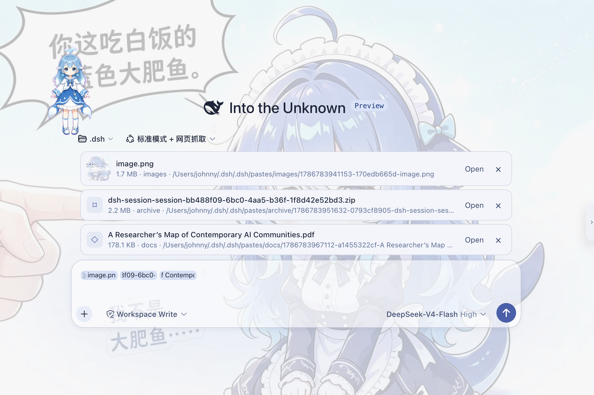

# dsh-paste-to-path

> **A universal attachment dock for DSH.**

[English](./README.md) | 简体中文

`dsh-paste-to-path` 给 DSH Web composer 增加了一个通用附件 Dock。

你可以直接拖入或粘贴图片、PDF、Word、Excel、压缩包、代码、日志以及其他文件，在发送前统一查看和管理它们。

<p align="center">
  
</p>

<p align="center"><em>图片、PDF、压缩包等不同格式，都可以放进同一个附件 Dock。</em></p>

DSH `0.1.0-rc.6` 的 Web composer 原生接收 PNG、JPEG、WebP 和 GIF。PDF、Office 文档、压缩包以及其他格式目前没有对应的统一附件入口；即使是图片，在不支持图像输入的模型或 text-only adapter 下，也可能无法直接发送。

`dsh-paste-to-path` 不去扩展模型原生的 content 类型，而是走另一条更简单的路径：

```text
文件
  ↓
DSH Host
  ↓
本地路径
  ↓
Agent
  ↓
你自己接入的工具
```

图片可以交给你自己接入的 vision 工具，PDF 可以交给文档读取工具，压缩包可以用 shell 或解压工具处理。

插件负责的是**附件接收、管理和路径传递**；文件具体怎么读取，由你的 Agent 工具栈决定。

---

## 路径流程概览

<p align="center">
  
</p>

<p align="center"><em>文件先保存到 DSH Host，再把路径交给 Agent。</em></p>

---

## 能做什么

### 通用附件 Dock

拖入或粘贴文件后，输入框上方会出现对应的附件卡片。

每张卡片会显示文件名、大小、类型和路径，并且可以在发送前移除。

图片还支持缩略图和灯箱预览。

---

### 多种文件使用同一套流程

图片、PDF、Office 文档、代码、日志、压缩包以及其他二进制文件，都走同一个附件流程：

```text
文件 → 保存到 Host → 路径引用 → Agent
```

不需要为每种文件类型单独设计一套模型输入协议。

---

### 长文本自动转成附件

普通文本仍然正常粘贴。

当粘贴内容超过设定阈值时，插件可以自动把它保存为 `.txt` 文件，而不是把几万字直接塞进输入框。

默认阈值是 `8000` 个字符。

---

### 发送前编辑文本文件

文本和代码附件在不超过配置的大小限制时，可以直接在 Dock 中修改。

默认上限为 1 MiB。

---

### 用系统应用打开文件

本机部署时，可以通过 DSH 的 `host.openPath` 使用系统默认程序打开附件。

---

## 安装

安装到 DSH Web profile：

```bash
dsh plugin --profile web add dsh-paste-to-path
```

npm 正式发布前，也可以直接从 GitHub 安装：

```bash
dsh plugin --profile web add github:Johnny-xuan/dsh-paste-to-path
```

安装完成后重新启动：

```bash
dsh web
```

包内包含 `dsh.bundle` manifest，所需的 loader patch 会随插件一起加载。

---

## 它是怎么工作的

当你把文件拖进或粘贴到输入框时，插件会先接住这个文件并保存到 DSH Host：

```text
<workspace>/.dsh/pastes/<分类>/
```

输入框中不会直接塞入文件内容，而是保留一个附件引用。

发送消息时，DSH 的 reference codec 会把这个引用展开成一段简短的路径说明：

```text
粘贴 / 拖入文件
        │
        ▼
保存到 DSH Host
        │
        ▼
Attachment Dock
显示附件卡片
        │
        ▼
发送消息
        │
        ▼
reference codec
生成文件路径说明
        │
        ▼
Agent 收到路径
        │
        ▼
调用当前可用的工具读取
```

整个过程使用 DSH 自己提供的扩展机制：

- `conversation.input.dock`
- input-trigger reference codec

不需要修改 DSH 核心代码。

---

## Agent 实际收到什么

插件不会把文件字节直接放进首次模型请求。

例如，一个 PDF 会被展开成：

```text
Document attachment: /absolute/path/to/report.pdf
Read it using an appropriate tool for this file format.
```

图片则类似：

```text
Image attachment: /absolute/path/to/image.png
Inspect it using an available image-reading method.
```

文本、代码、压缩包和其他格式也会生成对应的路径说明。

这些说明不会指定某一个固定工具。Agent 会根据当前会话真正可用的工具决定下一步怎么处理。

---

## 使用你自己的工具

`dsh-paste-to-path` 本身不提供文件解析能力。

你可以按照自己的 Agent 环境接入任意工具，例如：

- 图片 → 自己配置的 `read_image`、vision 工具
- PDF / Word / Excel → 文档读取工具
- 扫描件 → OCR
- 代码 / 日志 → shell 或文件系统工具
- ZIP / TAR → 解压工具

插件不会安装这些工具，也不会假设当前模型具备这些能力。

只要工具能够访问 DSH Host 上的文件路径，就可以读取插件保存下来的附件。

如果当前 Agent 没有适合的工具，那么文件虽然已经成功进入 Dock 并保存到 Host，Agent 仍然无法理解它的内容。

---

## 为什么使用路径

DSH 原生附件链路里，文件格式和模型能力通常绑得比较紧。

以 `0.1.0-rc.6` 为例，Web composer 当前接收：

- PNG
- JPEG
- WebP
- GIF

其他 MIME 类型不会进入同一套原生图片链路。

而通过格式检查的图片，如果最终进入一个不支持图像输入的模型或 text-only adapter，也仍然可能失败。

`dsh-paste-to-path` 把这两件事拆开：

```text
把文件交给 Agent
```

和：

```text
理解文件内容
```

插件只处理前一件事。

文件先变成 Host 上的普通文件，再由 Agent 的工具层负责第二步。

---

## 配置

默认配置位于随包提供的 `cordis.patch.yml`：

```yaml
- insert:
    - id: paste-to-path
      name: dsh-paste-to-path
      config:
        longTextAsAttachment: true
        longTextThreshold: 8000
        maxBytes: 26214400
        editableTextMaxBytes: 1048576
```

| 配置项                    | 默认值    | 说明                    |
| ---------------------- | ------ | --------------------- |
| `longTextAsAttachment` | `true` | 是否把长文本保存为 `.txt` 附件   |
| `longTextThreshold`    | `8000` | 长文本触发阈值，单位为字符         |
| `maxBytes`             | 25 MiB | 单个附件最大大小              |
| `editableTextMaxBytes` | 1 MiB  | Dock 中允许直接编辑的最大文本文件大小 |

需要修改时，在 profile 的 `cordis.patch.yml` 中覆盖 `paste-to-path` 对应配置即可。

---

## 文件存储

有 workspace 时，附件保存在：

```text
<workspace>/.dsh/pastes/<分类>/
```

没有 workspace 时回退到：

```text
$DSH_HOME/tmp-paste/<分类>/
```

文件权限为：

```text
0600
```

从 Dock 中移除一个附件，只会移除当前草稿里的引用，不会删除磁盘上的文件。

这样在撤销、重新发送或重新引用附件时，原来的路径仍然有效。

---

## 隐私

文件会从浏览器上传到你自己的 DSH Host，并保存在 Host 的本地文件系统中。

插件本身不会：

- 把文件直接上传给模型供应商
- 上传到第三方文件服务
- 在上传阶段解析文件内容

首次模型请求中出现的只是文件路径和一条简短说明。

如果 Agent 后续调用其他工具或外部服务处理文件，则以对应工具自己的行为和配置为准。

---

## 设计边界

`dsh-paste-to-path` 只负责这一段：

```text
File
  ↓
Attachment Dock
  ↓
Host filesystem
  ↓
Path reference
```

至于：

```text
Path
  ↓
Vision / PDF Reader / OCR / Shell / ...
```

属于 Agent 的工具层。

因此插件不会：

- 修改或替换模型 adapter
- 伪装模型具备视觉能力
- 绑定固定的 vision / OCR / document 工具
- 在传输阶段解析附件内容
- 生成 DSH 原生 `image` content block

---

## 兼容性

目前已在以下版本验证：

```text
DeepSeek Harness 0.1.0-rc.6
```

DSH 当前仍处于 developer preview。后续版本如果调整相关扩展接口，插件可能需要同步适配。
